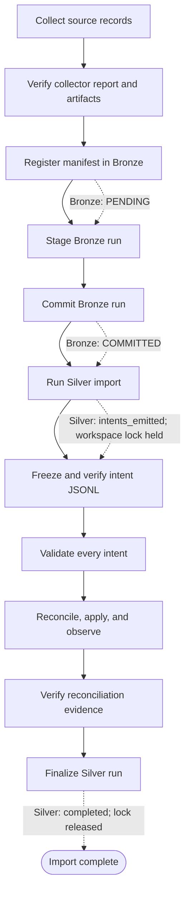

# Portable import orchestration

## Purpose

This is the required execution design for taking one source-system collection through Bronze, Silver, and Reconciliation into the Warehouse. It defines a portable, resumable workflow that can run as a shell driver or be expressed as UC4, Dagster, Kestra, etc.

The orchestrator owns sequencing, durable hand-offs, retries, and policy gates. Each CLI remains the authority for its own state and ledgers.

## Verified lifecycle

There are three distinct run identities:

| Identity | Created by | Meaning | Must be carried forward |
| --- | --- | --- | --- |
| `collector_run_id` | Collector | Immutable published source artifacts | manifest URI/hash, report URI/hash and all manifest outputs |
| `bronze_run_id` | Collector (currently the same ID) | Bronze ledger record for that manifest | workspace, manifest hash, staging evidence and commit result |
| `silver_run_id` | Warehouse Silver | Import/diff run for a committed Bronze run | Bronze ID, intent-file URI/hash, Silver result and reconciliation group |

The reliable state machine is:

```text
Collector: artifacts published + successful report
  -> Bronze: PENDING (manifest registered)
  -> Bronze: staging evidence registered
  -> Bronze: COMMITTED
  -> Silver: intents_emitted (workspace lock remains held)
  -> Reconciliation: validate all intents
  -> Reconciliation: apply and observe all intents successfully
  -> Silver: completed (finalize releases the lock)
```



What the CLIs actually enforce:

1. `collect run` writes immutable Bronze-format records and, only for successful job execution, a `run.manifest.json`; it also writes a `run.report.json`. The command emits JSON containing `run_id` and report `status`. A report can be `FAILED`; the orchestrator must reject it even if the process itself returned successfully.
2. `warehouse bronze register-manifest` schema-validates and hashes the manifest, then creates the Bronze run in `PENDING`. It records a reference; it does not copy collector records into the ledger.
3. `warehouse bronze stage-run` reads the manifest, stages/enumerates the artifacts through the configured backend, and records staging evidence. `warehouse bronze commit-run` verifies the manifest/staging evidence and artifact hashes and sizes, allocates per-stream commit sequences, and makes the run `COMMITTED`.
4. `warehouse silver run` accepts only a committed Bronze run. It produces a JSONL file of Reconciliation intents and ends with `status: intents_emitted`; it deliberately keeps the per-workspace Silver lock. It does not materialize those intents itself.
5. `reconcile validate` validates each intent, resolves its target and produces a non-mutating plan preview using an in-memory store. It is therefore an important pre-apply gate, but is not a durable approval record.
6. `reconcile run` persists intent/envelope/plan/attempt/observation records and performs application. It may return a result with no plan or attempt (for example, a rejected resolution) without a top-level command error. The result contents, not just the exit code, decide whether the hand-off succeeded.
7. `warehouse silver finalize --run-id <silver_run_id>` is valid only from `intents_emitted`; it transitions the Silver run to `completed` and releases its lock. This is the acknowledgement that the exact emitted intent set has met the reconciliation completion policy.

The implementation's Bronze state after staging is still `PENDING` with staging evidence recorded (despite older docs referring to `STAGED` or `COMMIT_READY`); `COMMITTED` is the visibility boundary Silver requires.

## Required orchestration contract

### 1. Durable run receipt

Create one immutable orchestration receipt per source import, stored in durable shared storage (object storage is preferred; a shared POSIX volume is acceptable initially). It is the only hand-off object between tasks. It must include:

- `orchestration_run_id`, tenant/customer, environment, workspace, system instance, target ref, and timestamps;
- image references pinned by digest and CLI version for Collector, Warehouse, and Reconciliation;
- immutable references and SHA-256 hashes for collector spec/run plan, connection catalog, warehouse/reconciliation wiring, flow/banding specs, and any context documents;
- collector result, report and manifest references/hashes; all manifest outputs, not only `outputs[0]`;
- Bronze register/stage/commit result payloads and artifact/staging references;
- the preallocated `silver_run_id`, exact intent JSONL reference/hash/count, Silver result payload, and workspace-lock ownership;
- reconciliation validation result, run result, execution-group ID/attempt ID, and the success-policy decision;
- sanitized command, start/end time, exit code, image digest, and log URI for every task.

Write receipts atomically (temporary object/file then rename) and never infer identifiers from human logs or search a filesystem for a manifest. A task consumes a receipt version and publishes a new receipt version only after validating the prior one.

### 2. Portable configuration and secrets

The orchestrator resolves its inputs from the existing environment variables, scheduler parameters, and Collector/Warehouse/Reconciliation configuration documents. Those existing specs and wirings remain their respective sources of truth; do not copy their contents into a second configuration layer.

An optional, versioned per-customer **import profile** may serve only as a thin selector for these existing inputs. It is not a required YAML file: the same logical values may come directly from environment variables or scheduler parameters. It must not contain credentials.

```yaml
# Illustrative resolved inputs, not a required new configuration file.
# Values can instead come from environment variables or scheduler parameters.
workspace_id: customer-a-prod
system_instance_id: oracle-hr
collector:
  image: registry.example/collectors@sha256:...
  spec: artifact://configs/oracle/collector.yaml
  connection_catalog: artifact://configs/connections.yaml
  root_uri: artifact://imports/customer-a-prod
  runtime_profile: oracle-client-kerberos
warehouse:
  image: registry.example/warehouse@sha256:...
  wiring: artifact://configs/warehouse.yaml
  flow_spec: artifact://configs/oracle/flow.yaml
  banding_spec: artifact://configs/banding.yaml
reconciliation:
  image: registry.example/reconciliation@sha256:...
  wiring: artifact://configs/reconcile.yaml
  target_ref: warehouse/ws_customer-a-prod
  completion_policy: observed_converged
```

Resolve the selected references before execution, schema-validate the existing documents, and record their content hashes in the receipt. Use a secret manager/runner secret binding for DSNs, tokens, Kerberos tickets, wallet files, and Oracle client configuration. An optional runtime profile may declare mounts and required environment-variable *names* (for example `TNS_ADMIN`, `KRB5CCNAME` and `LD_LIBRARY_PATH`); when used, it injects only its declared values. Do not indiscriminately forward a global environment, hard-code `/home/nox`, or mount Oracle/Kerberos files for every connector.

Artifact URIs are logical (`s3://...`, an artifact service URI, or a declared shared-volume URI). Each executor maps them to its own container path. This removes the current requirement that every image see the same `/data` and `/output` host mounts.

### 3. Success gates

The orchestrator must stop on any failed gate and preserve the receipt and lock state for recovery.

| Gate | Required assertion |
| --- | --- |
| Collect | collector JSON status and authoritative report are `SUCCESS`; every expected spec/stream has exactly the expected manifest output; manifest/report hashes are recorded |
| Bronze register | response identifies the expected workspace/run and manifest hash |
| Bronze stage | staging evidence corresponds to that manifest/run; do not treat a command exit as sufficient evidence |
| Bronze commit | response state is `COMMITTED`; verify every expected stream from the manifest, not only the first output |
| Silver | result run ID equals preallocated `silver_run_id`, status is `intents_emitted`, handoff emission is `succeeded`, and the JSONL exists, hashes to the recorded value, and contains the reported count |
| Validate | validate the complete, frozen JSONL using the same target/binding/context/group settings planned for apply; `ok=true` and `processed=intent_count` |
| Reconcile | `processed=intent_count`, `errors=0`; every intended item has an executable, admissible resolution, an allowed/acceptable attempt outcome, and—when policy requires it—converged observation evidence. Query the execution group as the durable aggregate proof. |
| Finalize | only after the prior reconciliation success receipt; output confirms the same Silver run is `completed` |

For a zero-intent Silver hand-off, validation/apply may be recorded as an explicit no-op, then finalize is permitted. Never silently substitute a fallback maximum that can truncate an intent file.

## Recommended task graph

```text
preflight resolved configuration/secrets/connectivity
  -> collect
  -> verify collector artifacts
  -> bronze register -> bronze stage -> bronze commit -> verify committed streams
  -> silver run (lock acquired and retained)
  -> freeze/hash intent JSONL
  -> validate exact JSONL
  -> reconcile exact JSONL + observe
  -> verify reconciliation evidence
  -> silver finalize (lock released)
```

Preflight includes CLI/image compatibility, access to the artifact store, config schema checks, required secrets/runtime profile, database migration/readiness, target-ref/workspace policy, and sufficient disk/object-store capacity. It must not collect or mutate the Warehouse.

Use a deterministic, externally allocated `silver_run_id` by passing `warehouse silver run --run-id ...`; derive a unique reconciliation `execution_group` from it, for example `silver/<silver_run_id>`. This makes retries and evidence lookup unambiguous. The source collector's generated run ID remains the Bronze run ID.

## Recovery and retries

Retries must resume from the receipt, never recollect merely because a downstream task failed.

- A task whose receipt proves its gate passed is skipped. A task without a durable result is reconciled against its subsystem state before re-execution.
- Reuse the same immutable manifest, Bronze run, Silver run, intent file/hash, target binding, and execution group for recovery. Recollection creates a new source/Bronze run and is a new import, not a retry.
- If failure occurs before Silver reaches `intents_emitted`, its failure path releases the lock; use the documented `silver run --retry --run-id <id>` only when the Silver state supports retry. Otherwise start a new Silver run against the already committed Bronze run.
- If failure occurs after `intents_emitted`, the lock is intentionally retained. Do not start another Silver run for that workspace. Resume validation/reconciliation from the frozen JSONL, inspect the reconciliation ledger/execution group, and finalize only after the completion policy is satisfied.
- If reconciliation has an uncertain external outcome, do not finalize. Reconcile's idempotency/deduplication and observation evidence are the recovery mechanism; use its redrive/query commands under an operator-approved policy.
- If finalization fails, leave the lock in place and retry only finalization after verifying the Silver run is still `intents_emitted` and reconciliation proof has not changed.

Lock expiry is a liveness escape hatch, not successful recovery. It does not roll back emitted intents or target-side reconciliation effects. A later Silver lock acquisition can reclaim an expired lock and mark its holding run failed; automation must not start a replacement run merely because this happened. It must first complete reconciliation recovery or follow an explicit operator-approved abandonment procedure.

The current CLIs need several operational capabilities for fully safe automation: a stable read-only Bronze run-status/get command (including manifest and staging/commit evidence), a documented Silver run/status query, explicit operator-approved Silver abandonment, and lock renewal for a reconciliation window that can exceed the lock timeout. Until then, the orchestration service may read the appropriate control-plane ledger through a supported read-only adapter, but should not guess based on filenames or rerun `stage-run` blindly.

## Failure handling and cleanup

Failure cleanup has two different rules:

- Delete only disposable, attempt-scoped working files: container scratch space, temporary uploads, temporary receipt files, and uncommitted staging areas whose ownership and failed state are certain.
- Preserve immutable source artifacts, manifests, reports, intent JSONL files, command results, and ledger/evidence records. They are needed for audit, diagnosis, and safe recovery. Retention policy—not a task failure—eventually removes them.

Never delete or overwrite an artifact when the task outcome is uncertain. First query the subsystem state and attach the result to the receipt. An operator must approve destructive remediation that could affect a committed Bronze run, emitted Silver intents, or a reconciliation attempt.

| Failed boundary | Immediate handling | Cleanup | Recovery / escalation |
| --- | --- | --- | --- |
| Preflight | Do not start collection. Record the missing prerequisite or invalid configuration. | Remove only task-local temporary validation files. | Correct the profile, secret binding, image availability, migration/readiness, or connectivity issue; start a new attempt. |
| Collection command or collector report is failed | Do not register a manifest in Bronze. Preserve the report and logs. | The collector cleans its own failed attempt staging; the runner removes only its local scratch files after logs/receipt are durable. Never delete published artifacts merely because the aggregate run failed. | Fix source credentials/runtime dependencies or source availability, then recollect as a new collector/Bronze run. |
| Collector output fails the artifact gate | Do not enter Bronze. Quarantine the receipt as failed. | Do not alter manifest/report/published records; remove only orchestration temporary files. | Resolve missing, duplicate, unexpected, or hash-mismatched outputs. Recollect rather than constructing or editing a manifest. |
| Bronze manifest registration fails | Do not stage or commit. Preserve manifest and command result. | No ledger cleanup is needed unless a supported status query proves no run was created; do not delete the manifest. | Correct the manifest/workspace/configuration issue. If the result is uncertain, query Bronze before retrying idempotently. |
| Bronze staging fails or outcome is unknown | Do not commit. Preserve the Bronze record, manifest, logs, and any known staging evidence. | Do not blindly delete backend staging or rerun staging: a successful-but-unrecorded stage can conflict on retry. Provider-specific staging cleanup is allowed only after a Bronze status/evidence check proves the stage did not complete. | Retry only after state inspection. Escalate a stranded backend staging area to the backend owner if no supported cleanup/status operation exists. |
| Bronze commit fails | Do not run Silver. Preserve manifest, staging evidence, backend state, and commit result. | Do not remove staged data or mutate the Bronze record automatically; hash/evidence failures require investigation. | Correct the evidence/configuration cause and inspect Bronze before a retry. Retraction is only relevant after a confirmed committed run and requires an explicit, approved remediation decision. |
| Silver run fails before `intents_emitted` | Do not reconcile or finalize. Record the failed Silver result. | The Silver CLI releases the workspace lock on its failure path. Remove only invalid/temporary intent-file remnants; retain any diagnostic result/log artifacts. | Where the Silver run supports it, use `silver run --retry --run-id <id>`; otherwise create a new Silver run against the already committed Bronze run. |
| Silver emits intents but validation fails | Do not apply or finalize; keep the workspace lock. Preserve the exact intent file/hash and validation result. | Do not delete or regenerate the intent file. | Correct the target binding/spec/context or the underlying data issue, then revalidate the same frozen intent set. Escalate if an operator must abandon the run, because normal finalization is not permitted. |
| Reconciliation is partial, failed, or uncertain | Do not finalize; keep the workspace lock. Preserve validation output, run output, execution-group evidence, and all target-side evidence. | Never automatically roll back target-side changes or delete reconciliation ledger records. Lock expiry is not cleanup and does not make a replacement run safe. | Query the execution group and per-intent attempts/observations; use supported idempotent retry/redrive procedures under the reconciliation policy. Escalate unknown/partial outcomes for operator decision; a replacement run requires explicit approved abandonment, not mere lock expiry. |
| Silver finalization fails | Do not start another Silver run. Keep reconciliation evidence and the held lock. | No cleanup. | Verify the Silver run remains `intents_emitted` and the same reconciliation proof is complete, then retry finalization. Escalate a lock that cannot be safely finalized. |
| Completed import | Publish the final receipt and completion event. | Retain all evidence until the customer retention period ends; then expire artifacts through a scheduled retention job, not the workflow task. | No retry is required. A subsequent collection is a new import. |

## Shell and ETL implementations

The shell implementation should be a thin task runner around the receipt contract: one command per task, JSON stdout captured directly to an immutable result artifact, structured logs on stderr, explicit gate validation, and `resume --receipt <uri>` / `status --receipt <uri>` commands. It should accept the existing environment variables and/or scheduler parameters plus secret/runtime bindings; a thin import profile is optional, not required.

For UC4, Dagster, Kestra, Airflow, or similar, make each box in the task graph a discrete task with the receipt URI as its input/output. Mark collection, Bronze stage/commit, and reconciliation application as non-replayable without their gate/state check; make validation and receipt verification replayable. Set a concurrency key of `workspace_id` from Silver run through finalization, plus source/connection keys as required by the collector. Alert well before the Silver lock's two-hour default expiry. Do not make expiry a scheduler retry trigger; long-running reconciliation needs lock renewal or an explicitly controlled longer timeout.

The orchestrator must redact DSNs, tokens, and runtime environment values in receipts and logs, and retain artifacts/evidence according to the customer's audit policy.

## Migration from a customer-specific MVP driver

The existing MVP shell driver has the right broad ordering, but must be replaced by an implementation of this document before it is reused across environments:

- It hard-codes paths, Podman mechanics, labels, image tags, database schemas, and Oracle/Kerberos mounts, then forwards a broad environment set.
- It parses JSON from mixed stdout using `jq`, discovers the manifest with `find`, and assumes exactly one manifest and only `outputs[0]`. This breaks multi-output collections and non-shared filesystems.
- It does not fail when the collector reports a failed run, and it uses only one stream for the committed-record check.
- It validates only `--max-intents 200` but applies `MAX_INTENTS_EFFECTIVE`, which may be much larger. Thus unvalidated intents can be applied. It must use the exact frozen file and identical count for both operations.
- It treats a zero exit from `reconcile run` as enough to finalize, although result payloads can represent rejection/no attempt. It must apply the reconciliation completion policy above.
- Its optional reconciliation introspection is broken twice: `RECONCILE_INTROSPECT` has malformed parameter expansion and `get execution-groups` is not a valid CLI command. The singular query is `get execution-group`; list operations use `list`.
- It allows a generated Silver run ID yet does not record it until after the command, weakening recovery correlation.
